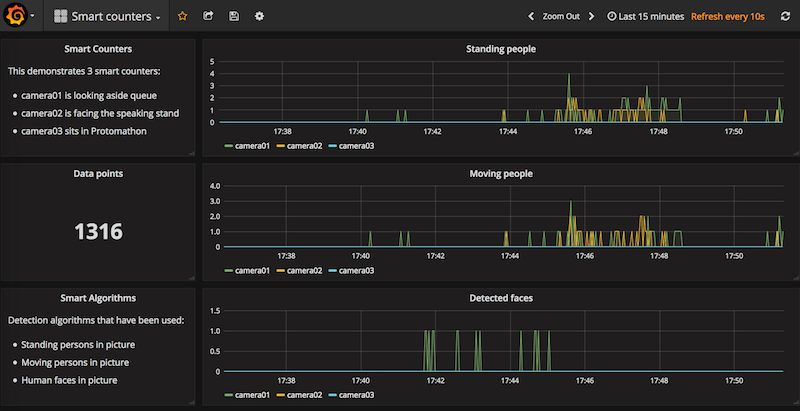
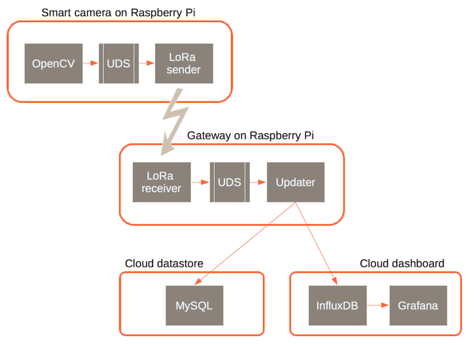

# The No-picture Camera project

Raspberry Pi with camera and OpenCV, a better solution than CCTV

## Why this project?

New "remote eyes" are added every day, and this is scaring.

While closed-circuit televisions (CCTV) have been around for a while, most of them were designed by skilled professionals. Only seasoned experts could optimize costs of so expensive video systems, and ensure that public CCTV align with constraining regulations.

Helas, the end-to-end security and architectural control that was the rule for professional CCTV does not exist for consumer-grade cameras. Internet cameras are rapidly becoming a commodity, so that most people can afford to buy and to deploy some of them. For example, you can get a Raspberry Pi and a companion camera for less than 100 euros, and this can be immediately connected to the Internet over Ethernet or WiFi. This is commonly used for remote monitoring of houses, shops or any property of interest. Internet cameras do provide remote visibility, but are not protected nor integrated like CCTV used to be.

The millions of images taken by Internet cameras is like a non-controlled firehose. Each image reaching the public Internet can be stored and used for ever, which can be a definitive compromise to privacy. And since the technology progresses every day, there are risks that old images are re-processed so as to identify additional persons, things, or any other information of interest.

One could argue that the storage of images is the weakest point, and that its security can be considerably improved. This is correct, but there is a better analysis. Actually, the root cause of this problem is the transmission of bare images itself. After all, if human beings have a brain behind the eyes, it is for some reasons. We do not share what we see, but we talk about what we see. Shepherds do not sent pictures of their lambs, but they report on how many they have.

So, why not consider the same approach with cameras? With "remote eyes with brain", the transmission of bare images can be completely avoided.
The system that we are looking for is still based on cameras, but complemented with embedded analysis software. The software turns images to a flow of useful information extracted from images.

We believe that the No-picture Camera is a great improvement, because:
* images are not stored nor transmitted, so the solution is safe for citizens
* only counters are transmitted over the network, so anonymity is preserved
* image processing can be adapted to specific needs, e.g., count cars or persons or birds, making it a smart approach
* it is an open source project that delivers ready-to-use packages and instructions, making it easy to deploy

## How is this done?

The design of the no-picture camera distinguishes image processing from information handling. Scanning is a dedicated process implemented with OpenCV and related software. The outcome of this process is sent over a Unix Domain Socket (UDS) to a list of updaters for transmission or for storage. Updates are handled in a separate process.

The same design has been used for LoRa communications so that, in the end, multiple deployment architectures can be considered:
* a standalone Raspberry Pi with camera and with embedded database and dashboard
* multiple Raspberry Pi with cameras connected over LoRa to a central Raspberry Pi hosting the database and the dashboard
* 3-layer architecture: Raspberry Pi cameras communicate over LoRa to one Raspberry Pi gateway that updates the database and the dashboard over Internet

On this diagram we can see that:

* For a No-picture Camera, the LoRa sender is an updater like others
* At the gateway, updaters make no difference between a scanner and a loRa receiver
* The InfluxDB database and the Grafana dashboard are accessed over IP, so they can be co-located with a camera, with a gateway, or be run on completely separated computers.

## What is needed to deploy some No-picture Cameras?

Read [instructions to setup a standalone camera](docs/setup.standalone.md), including OpenCV, the scanning software, the InfluxDB database and the Grafana dashboard, all on the same Raspberry PI.

If you have multiple boards, then consider [instructions to connect smart cameras over LoRa](docs/setup.lora.md). All cameras will run OpenCV, and one Raspberry Pi will act as a central datastore, with InfluxDB and Grafana, so that you can enjoy cameras data from a single pane of glass.

## Where to find additional assistance?

Well, maybe you would like to check [Frequently asked questions](docs/questions.md) and related responses.
Then you can [raise an issue at the GitHub project page](https://github.com/bernard357/smart-video-counter/issues) and get support from the project team.

## How would you like to contribute?

We want you to feel as comfortable as possible with this project, whatever your skills are.
Here are some ways to contribute:

* [use it for yourself](docs/contributing.md)
* [communicate about the project](docs/contributing.md)
* [submit feedback](docs/contributing.md)
* [report a bug](docs/contributing.md)
* [write or fix documentation](docs/contriuting.md)
* [fix a bug or an issue](docs/contributing.md)
* [implement some feature](docs/contributing.md)

Every [contribution and feedback](docs/contributing.md) matters, so thank you for your efforts.

